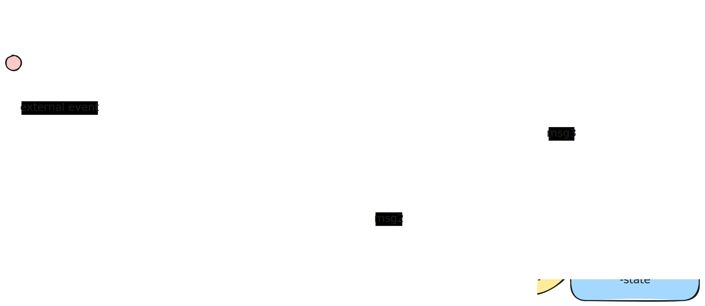
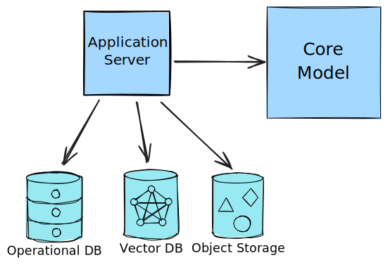
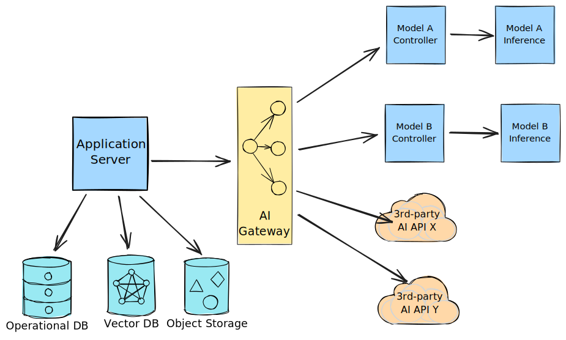
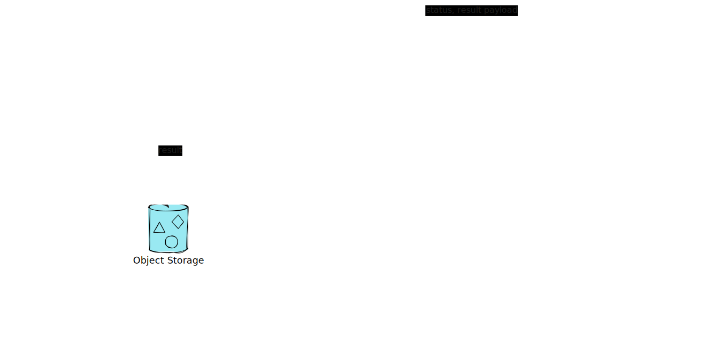
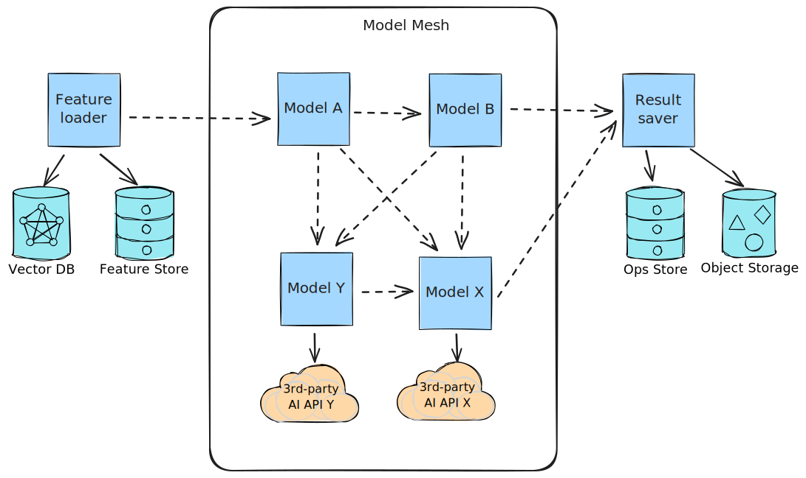
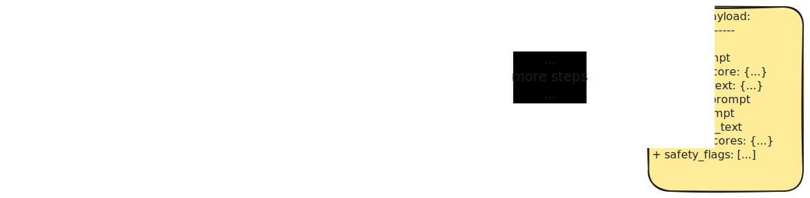

## Introduction

Building intelligent systems at scale is tricky. On the surface, modern AI gives us powerful components (LLMs, Transformers, ML) ready to integrate into our applications. Yet assembling these pieces into a coherent, resilient, and cost-effective whole remains a tough challenge, especially as systems grow beyond simple request-response patterns.

This article presents a comprehensive approach to this problem through the Actor Mesh pattern: a distributed architecture that organizes AI models, machine learning pipelines, and conventional business logic as a network of autonomous, asynchronous actors. Rather than forcing AI workloads into rigid orchestration pipelines or monolithic models, this pattern allows intelligent components to collaborate fluidly, adapting their behavior based on intermediate results and real-time conditions.

The architecture shines in scenarios where you face several interrelated challenges:

- **Heterogeneous intelligence**: Your system needs multiple specialized models: general-purpose LLMs paired with custom-trained classifiers, computer vision systems, and domain-specific logic.
- **Complex, adaptive workflows**: Processing logic branches conditionally, loops based on quality scores, and routes dynamically based on content. Static pipelines simply won't work.
- **Massive scale**: You're processing hundreds of thousands of requests daily, and scaling isn't just about spinning up more servers. It's about intelligent resource allocation where different components have vastly different compute requirements.
- **Fault tolerance**: Failures in one component shouldn't cascade across the system.
- **Cost discipline**: You need granular control over costs at each processing stage.

These aren't theoretical concerns. We encountered all of them while building an intelligent image processing system at [Delivery Hero](https://deliveryhero.jobs/): a platform that had to seamlessly blend generative AI, computer vision, expert decision-making, and conventional business services. By applying the Actor Mesh patterns described in this article, we built a system capable of processing hundreds of thousands of media files daily on a lean Kubernetes cluster (roughly 100 pods), maintaining both high reliability and remarkably low operational costs.

This is where my decades-long interest in distributed systems and experience in building high-throughput streaming application came handy. Kudos to the team who dared to leave the beaten track of REST APIs and DAGs and harnessed the power of asynchronous actors in practice: [Artem Yushkovskiy](https://www.linkedin.com/in/atemate/), [Omar Ghetti](https://www.linkedin.com/in/omarghetti/) and [Sonia Veselova](https://www.linkedin.com/in/sonia-veselova-8206b9192/).

The guide starts with the base building blocks, considers several typical approaches as the systems evolve, and then keeps adding more patterns and techniques that help the teams address the challenges as they emerge. Then it is completed with some practical examples, tips & tricks, and off-the-shelf implementations.

## Actor Model - core paradigm

The core of our approach is the [Actor model](https://en.wikipedia.org/wiki/Actor_model) [[HEWITT73](#references), [AGHA86](#references)]. In this paradigm, the system is composed of **actors**  -  independent computational units that communicate exclusively via **messages**. Each actor has a **mailbox** (a message queue) for incoming messages. Other actors interact with it by sending messages to its unique **address**. An actor encapsulates its own private **state** (typically in-memory), which is inaccessible from the outside. Finally, each actor defines a **behavior**  -  the logic it executes when processing messages from its mailbox.

When an actor processes a message, it can perform several key actions: send a finite number of messages to other actors (whose addresses it knows), create a finite number of new actors, or update its own internal state. This simple set of rules enables the construction of highly scalable and resilient systems, as actors can be distributed across multiple cores or even different machines.



In the diagram above, we see three actors: A, B, and C. Each actor has its own mailbox, behavior, and state. Processing begins when an external event arrives at the mailbox `@A` of Actor A. Actor A then sends messages to Actors B and C using their addresses `@B` and `@C`. Actor B also sends a message to Actor C. In the Actor model, routing is highly flexible: any actor can send a message to any other actor if it knows its address. Actors can even receive an address as part of a message and dynamically send results to that address. This enables fully asynchronous communication, unlike static pipelines or directed acyclic graphs (DAGs).

Key characteristics of actor-based systems include:

- **Low coupling:** Actors are autonomous and well-isolated in both runtime state and code, allowing different actors to be implemented or replaced with minimal impact on the rest of the system.
- **Native concurrency:** Actors are inherently concurrent and do not share state. Scaling is straightforward - simply run more computation units connected to the same mailbox to increase throughput.
- **Flexible routing:** Unlike static pipelines or DAGs, actors can dynamically change message routes at runtime. Routes can even include loops, enabling repeated operations. This flexibility simplifies complex workflows and supports data-driven, intelligent processing.

These properties make actors an ideal foundation for distributed systems, especially in data-intensive domains like AI and agent-based architectures. You can define specialized actors for tasks such as input handling, data preprocessing, prompt generation and optimization, LLM or ML model integration, post-processing, persistence, and more.

## Mesh Topology

To discuss the topology of an AI-centric system, let's first look at some examples of conventional AI engineering architectures that have been popular in recent years:

- Model Monolith
- AI Gateway
- AI Pipelines

Then we'll see how the Model Mesh approach differs from these patterns.

### Model Monolith

At the heart of this architecture is typically a main model, such as a massive LLM with many parameters and potentially multi-modal input/output capabilities, which acts as the "brain" of the system. Other components are built to supply data and infrastructure around the main model.



In many popular cases, the `Core Model` in this diagram is actually an SDK wrapper around a third-party LLM (such as OpenAI's GPT, Google Gemini, Claude, etc.). The `Application Server` can be split into a more modular or microservice architecture. For simplicity, we focus less on the conventional backend and more on the interaction with AI/ML components here.

Benefits:

- Easy to understand and get started with
- Easy integration with conventional application code

Limitations:

- AI capabilities of your app are limited by capabilities provided by its core model
- Hard to diversify risks and optimize costs by driving traffic to alternative APIs
- Potential scalability issues for self-hosted models
- Potential vendor lock-in with a specific third-party API provider

When to use:

- As a starting point or for prototyping
- When there is only one type of AI/ML tasks
- In HTTP-based request/response systems

A Monolith is a great starting point. As intelligent features of your AI application grow, the system may need to include multiple intelligent steps of different nature and complexity. For example, if a smaller model is used for preprocessing the prompt, or different models are used to score the output of the core model, using the core model for side tasks becomes an overkill, limiting scalability and cost-efficiency. In such cases, the AI Gateway pattern comes to the rescue.

### AI Gateway

If the system uses multiple LLMs, surfaces multiple API providers, or calls multiple model wrappers in a synchronous request/response manner, the AI Gateway is a common pattern to separate AI/ML concerns from application logic.



In the diagram above, the `Application Server` still handles all business logic, workflow orchestration, and persistence. However, the AI/ML layer is split into smaller, more specialized models, each available via its own endpoint (usually an OpenAI-compatible HTTP API). The `AI Gateway` solves problems of queueing, load balancing, and rate limiting for both in-house and third-party models. Sometimes, an AI Gateway is coupled with a dedicated model that selects the best model for a task in terms of result quality and request cost.

As AI Gateway's popularity is growing rapidly, more and more flavors of AI Gateways are being added. Offered features and stability may vary between implementations. We expect this pattern to continue evolving and gaining traction in the near future.

Advantages:

- Supports different model types for different tasks and workloads
- Fits well with synchronous request/response interaction styles
- Can help reduce costs

Limitations:

- AI Gateway is an adapter pattern; it is part of the AI infrastructure but does not shape data flow or business logic, which remain in the conventional application layer
- Rooted in synchronous protocols, AI Gateway does not help with offloading heavy computations to the background or scaling inference infrastructure to handle increased throughput. While HTTP-based Horizontal Pod Autoscaling can help, errors are hard to avoid while the compute infrastructure is scaling up

When to use:

- In HTTP-based request/response systems
- When the system has outgrown the Model Monolith by adding more specific tasks and workloads
- To benefit from cost savings or higher output accuracy by routing requests to the best-fit models

### AI Pipelines

The most popular approach to asynchronous workloads is via pipelines. This approach has its roots in Data Engineering and MLOps, where pipelines are used for Extract-Transform-Load (ETL) workloads, machine learning training workflows, and more. This approach is now being adapted for inference:



AI/ML pipelines usually include a model serving layer consisting of an orchestrator and pipelines that run tasks. Pipelines can be simple linear step sequences, as well as trees and Directed Acyclic Graphs (DAGs), allowing for logical branching but not loops. The `Orchestrator` is a critical part of the infrastructure: it schedules pipelines, controls their execution, and manages their input and output. This serving layer can run multiple copies of the same pipeline in parallel to achieve higher throughput, as well as different pipelines simultaneously. In some systems the whole pipeline runs on the same machine as a sequence of steps. In others, especially Kubernetes-based, parallel execution and sophisticated orchestration is more common. Data exchange can occur via shared storage, messaging systems, or direct inter-process communication, depending on the orchestrator and pipeline design.

Popular pipeline serving solutions for AI workloads include Kubeflow Pipelines, Google Vertex AI Pipelines, Ray Serve, Metaflow combined with Airflow, and Argo Workflows.

Advantages:

- Familiar mental model for Data and ML teams
- Designed to run batch jobs at scale

Limitations:

- Usually not suitable for streaming and real-time use cases. While batch pipelines excel at processing large datasets periodically, many modern AI applications require continuous processing of incoming data streams [[HUYEN22](#references)].
- Static routing with DAGs makes it hard to implement highly dynamic and agentic scenarios
- Scaling at the pipeline level may be suboptimal in terms of throughput and resource usage
- The serving and orchestration layers may introduce resource overhead

When to use:

- Batch processing with a statically determined processing logic
- Combining classic ML pipelines with AI models in asynchronous workflows

### Model Mesh

Model Mesh was [introduced by KServe](https://github.com/kserve/modelmesh?tab=readme-ov-file) as part of a Kubernetes-based serving layer in response to the challenges of monolithic inference serving architectures. The term "Model Mesh" has since spread, similar to "Data Mesh" [[DATAMESH](#references)], to refer to general topologies and principles for designing ML-enabled system architectures.

A model mesh consists of a network of specialized AI models that collaborate dynamically to solve complex problems that no single model could handle effectively. Unlike monolithic AI systems, where a single large model attempts to handle all aspects of a problem, a model mesh distributes responsibilities across specialized components. Each model becomes an expert in its domain - whether that's visual analysis, language understanding, quality assessment, or content generation. This specialization allows for more accurate results and easier maintenance, as individual models can be updated, retrained, or replaced without affecting the entire system.



The mesh operates through message passing between models, where each component enriches the data with its specialized analysis before passing it along. For example, a computer vision model might extract image features and pass them to a language model for caption generation, which then routes to a quality scorer, and finally to an enhancement model if needed. This collaborative approach enables the system to tackle complex, multi-modal problems that require diverse types of intelligence working together.

The non-linear interaction pattern is crucial here. Rather than following a fixed pipeline, models can communicate in various sequences based on data characteristics and intermediate results. A low-quality score might trigger additional processing steps, while high-confidence results might skip certain validation stages entirely, creating an adaptive workflow that optimizes both accuracy and efficiency.

Advantages:

- Specialized models solve specific tasks with higher accuracy
- Enables dynamic adaptive workflows for complex and agentic behaviours
- Different parts of the mesh can be developed, scaled, and updated independently
- Optimized resource usage by scaling each model based on demand
- In case of failure in one of the components, it is easy to isolate the impact from other components and easy to detect it with basic instrumentation

Limitations:

- Initial setup and design effort can be significant due to higher orchestration complexity and less common mental model
- Out of the box such architectures are good at handling high throughput but may suffer from increased latency due to active use of message queues
- Requires careful design of model interfaces and data contract
- Debugging and end-to-end monitoring requires some sort of distributed traces

When to use:

- For complex, multi-modal AI systems requiring diverse, specialized intelligence
- When dynamic, data-driven routing and agent-like collaboration are needed
- If independent scaling and updating of AI components are critical
- To build resilient systems where individual component failures are tolerated

Now that we are settled on the topology of the system, it's time to do a deep dive on communication and orchestration patterns that can bring this topology to life.

## Communication and Orchestration

The key difference in how processing flows are organized in Actor Mesh from many topologically similar solutions is this: **there is no Orchestrator/Controller/Scheduler**. There is no central node that is responsible for coordinating workers, scheduling tasks, and controlling execution. An Actor Mesh is a peer-to-peer network.

This design decision has three main advantages over traditional systems with a central orchestrator:

1. Simplified infrastructure: no need to maintain dedicated software for the serving layer and orchestration
2. Simplified mental model: all components are actors, they do what you program them to do
3. Extreme flexibility: implement as many and as complex of the workflows as needed. You can even implement a system of systems where each subsystem functions completely independently

But how does it know what to do and in which sequence? And how can you be sure that the job gets done? By implementing decentralized, choreography-based distributed sagas.

### Choreography-based sagas

Traditional distributed systems often rely on a central orchestrator to coordinate complex workflows across multiple services. Choreography-based sagas [[GARCIA87](#references), [RICHARDSON18](#references)] invert this model by distributing coordination logic among the participating actors themselves. Each actor knows when to act, whom to notify, and how to handle both success and failure scenarios, resulting in a self-organizing distributed workflow.



In the example above, each actor determines the next processing step and knows the addresses of relevant mailboxes. The `Input Analyzer` examines the user request and decides whether it is sufficient to proceed or if more context is needed - either from a local knowledge base via `@local_retriever` or from a web search via `@web_retriever`. The `Local Retriever` may determine that its contribution is insufficient and forward the message to the `Web Retriever`. Eventually, the user prompt and context are used by the `Prompt Builder` to construct a final prompt for the generative model - the `Generator`. Each generated response is evaluated by the `Quality Scorer` actor. If the score is low, the message may be sent back to the `@generator` for another attempt. In some cases, the response is correct but too concise or requires a change in style or tone - in these cases, the message is sent to a specialized `Prompt Enhancer`, which rewrites or expands the previously generated response instead of generating a new one. Finally, responses that pass quality control are collected by the `Safety Checker` for a final review before being sent to the user or another system.

This distributed coordination approach is particularly effective for AI workloads, where different processing stages may have vastly different execution times and resource requirements. The `Prompt Builder` may complete in milliseconds, while the `Web Retriever` or `Generator` can take seconds or even minutes for some requests. Rather than relying on a central orchestrator to manage these timing differences, each actor operates independently and triggers the next appropriate steps when ready.

The choreography pattern also enables dynamic routing based on intermediate results. For example, an actor receiving a low-quality score can route the message to enhancement processing, while high-quality results can skip directly to final validation. This adaptability allows the system to optimize both processing time and resource utilization without requiring complex central logic for routing decisions.

In traditional stateful processing applications, another important feature of distributed sagas is rollback flows. When failures occur, the distributed saga handles compensation through a similar choreographic approach. Each actor is aware of how to undo its actions and whom to notify for upstream rollbacks. This creates a resilient system where failures in one component do not require a central coordinator to orchestrate recovery across the entire workflow. For stateless processing, where results are not persisted in a database, reverse sagas become less important and can often be replaced by simple retry loops.

While distributed, decentralized sagas are extremely robust and powerful, they can also lead to logic being spread too widely throughout the system. This may result in actors having too many responsibilities, making it harder to understand and modify the application's routing logic.

### Smart Routers, naive Processors

To address the high coupling and complexity of the distributed saga pattern described above, we introduce a simple two-tier hierarchy for our Actors: **Routers** and **Processors**.

Most actors are **Processors**: they simply receive messages at their mailbox and process them. They do not need to know the destination address of the message, as this address is included as part of the message itself.

**Routers**, on the other hand, are responsible solely for routing logic. Based on the input they receive in the message _payload_, they may decide to modify the message _route_. Thus, a typical message in our system contains at least two parts: **route** and **payload**.

```json
{
    "route": {
        "steps": [
            "input_analyzer",
            "local_retriever",
            "prompt_builder",
            "generator",
            "quality_scorer",
            "safety_checker"
        ],
        "current_step": 2
    },
    "payload": {
        // Actual message payload is here
    }
}
```

Note that the route steps are sequential, and there is a pointer to the current step. Whenever an actor completes its job, it increments the step counter and sends the message to the mailbox address specified in the next step of the route.

In the diagram from the previous section, it makes sense to turn `Prompt Analyzer` and `Quality Scorer` into Routers responsible for modifying the route, while the rest of the actors follow the route naively.

This two-tier approach makes it much easier to organize the codebase and improves the maintainability and extensibility of the application over time. Processors remain routing-agnostic and highly reusable, while Routers concentrate the routing logic in compact, easily modifiable components.

Another advantage of including the route in each message is that you get simple tracing out of the box: each message shows which steps it has already passed and which steps were added to the route. Need to replay a message from a certain step? Just reset the `current_step` to the desired position. Though for complex application we recommend the routes to be append-only for better auditability.

### Error handling scenarios

Error handling and recovery also become routing tasks. In case of an error, each actor should decide what kind of problem it is facing:

#### Retriable errors

A **Retriable error** is a temporary error that can be resolved by simply repeating the same action. A typical example is a HTTP call failure that can be solved by a simple HTTP retry mechanism.

The actor may implement retry in the payload handling logic, e.g. by using an HTTP client with built-in retry, backoff and circuit breaker. An alternative approach is to send the input message back to the mailbox queue, so that it will be processed again with a certain delay.

#### Recoverable errors

A **Recoverable error** is an error that cannot be resolved with a retry but requires complex logic or performing compensation operations.

An example of a recoverable error would be a case when processing with one set of steps didn't give a desirable result, and a different set of steps should be used instead.

Some autonomous actors may overwrite the route in a response to an error right away instead of sending to an external recovery handler. For example, let's assume that generating a response with `model-a` has produced a low score and the actor makes a decision to try again with `model-b` instead:

```python
if msg.payload.scores.average <= AVG_SCORE_THRESHOLD:
    # Try again with model-b
    msg.route.steps = (
        msg.route.steps[:msg.route.current_step + 1]
        + ['model-b', 'scorer', 'judge']
        + msg.route.steps[msg.route.current_step + 1:]
    )
```

> Note: in the above example we are inserting a new sequence of steps after the current one instead of overwriting the earlier route and resetting the current step pointer. This technique helps us preserve the entire journey of each message and use it for debugging and analytics purposes.


Another classic example is from transactional sagas: an operation failed and it has to be rolled back at multiple actors. In such case the actor should send the message to the corresponding `@recovery_handler`. A recovery handler is a router that is going to add compensation or recovery steps to the message's route.

A more unified and convenient way to organize error recovery is to specify an error handler mailbox in the message route, so that all the recovery handling logic is then delegated to the recovery handler. Here is a slightly modified message schema to accomodate for that:

```json
{
    "route": {
        "steps": [
            "input",
            "retriever",
            "prompt_builder-v1",
            "generator",
            "scorer",
        ],
        "current_step": 2,
        "error_handler": "recoverer"
    },
    "payload": {
        // Actual message payload is here
    }
}
```

Then depending on the type of error, our `Recoverer` would come up with different solutions, e.g.

```python
def handle_recoverable_error(msg):
    route = msg.get("route", {})
    steps = route.get("steps", [])
    current = int(route.get("current_step", 0))
    payload = msg.get("payload", {})

    # Get the error and its type from the payload
    err = payload.get("error")
    err_type = err.get("type", "fatal")

    # Simple decision tree for the route override
    if err_type == "inference_error":
        alternative = ["generator-retry", "quality_scorer"]
    elif err_type = "prompt_error" or "validation_error":
        alternative = ["prompt_enhancer", "generator", "quality_scorer"]
    else:
        alternative = ["error_logger"]

    # Updating the route after current position
    insert_pos = min(current + 1, len(steps))
    steps[insert_pos:insert_pos] = alternative

    # Writing recovery log, for audit
    payload.setdefault("recovery_log", []).append({
        "time": datetime.utcnow().isoformat() + "Z",
        "error": err,
        "inserted": alternative,
    })

    return msg
```

#### Fatal errors

A **Fatal error** is an error that can be neither retried nor recovered, which means that there is no reason to continue processing the message. In this case the actor has to send it to the `@failure_handler` for proper logging and user notification.

---

Defining sagas as dynamic routes provides a flexible and powerful way to organize communication in our distributed mesh. However, routing is only one part of the communication protocol. Actors also need a set of safe rules for reading and modifying payloads.

### Content Enricher pattern
Raw data rarely contains all the information needed for intelligent decision-making. The [Content Enricher](https://www.enterpriseintegrationpatterns.com/patterns/messaging/DataEnricher.html) pattern [[HOHPE03](#references)] from Enterprise Integration Patterns addresses this by incrementally augmenting messages with additional context, metadata, and derived insights as they flow through the system. Unlike transformation patterns that convert data from one format to another, content enrichment preserves the original payload while adding layers of intelligence around it.



In our example AI pipeline from the previous section, each enricher specializes in adding a specific type of intelligence, which is appended to the message payload. For instance, the `LocalRetriever` adds a `local_context` object, while the `WebRetriever` adds a `web_context` - regardless of whether `local_context` is present. When the `PromptBuilder` constructs the prompt for the LLM, it appends the prompt as another field in the payload. The results of generation are also appended, and so on. Each actor validates its contract by checking if the required data is present in the payload, reads the data, and then appends its own results to the enriched message. Because each enricher operates independently, the system can scale different types of analysis as needed, and a failure in one enrichment step does not break the entire flow.

This pattern creates a cumulative intelligence effect, where later stages benefit from all previous enrichments. For example, a content generation model can produce better results when its prompt includes extended context from multiple sources. A decision-making node can leverage different types of scores and evaluations that were calculated separately. This layered approach to data augmentation enables sophisticated decision-making while maintaining a clear separation of concerns between different types of analysis.

What makes this pattern particularly powerful in AI systems is its ability to handle uncertainty and partial failures gracefully. If one enricher fails to add its contribution, the message continues with whatever enrichments were successfully applied. This resilience ensures that the system degrades gracefully, rather than failing completely when individual components encounter issues.

Beyond enabling loose contracts within the system, the Enrichment pattern allows for unbounded horizontal scaling without the need for complex synchronization - provided the domain supports monotonic computations.

### Monotonic computations

Engineers with experience in distributed systems know the pain of merging and coordinating parallel data streams. Scaling out often starts smoothly, but as soon as you need to merge data or reassemble scattered pieces, complex stateful processing becomes necessary. This is when you encounter reducers, in-memory databases like RocksDB, and increasingly challenging fault-tolerance requirements.

However, distributed computing doesn't always have to be painful. In their influential paper, [Keeping CALM: When Distributed Consistency Is Easy](https://arxiv.org/pdf/1901.01930) [[HELLERSTEIN19](#references)], Joseph M. Hellerstein and Peter Alvaro introduce the CALM theorem. **Consistency As Logical Monotonicity (CALM)** states that a distributed program can be implemented in a consistent, coordination-free way if and only if it is **monotonic**.

- A _monotonic program_ ensures that its output only grows (or remains the same) as more input data is added; it never "retracts" previous results.
- In contrast, _non-monotonic programs_, which may need to retract or overwrite earlier outputs when new data arrives, intrinsically require coordination to maintain correctness.

What does the CALM theorem mean for building distributed systems in practice?

- **Consistency, Availability, and Partition-tolerance** can be achieved simultaneously. When network partitioning occurs in a monotonic program, data remains consistent and highly available within each partition.
- Declarative, immutable, and functional patterns are encouraged, as they make implementing monotonic programs more natural. This applies not only to programming language choice but also to higher-level design, such as using dataflow programming with immutable, append-only structures.
- Techniques like [CRDTs](https://crdt.tech) [[SHAPIRO11](#references)], [tombstones](https://en.wikipedia.org/wiki/Tombstone_(data_store)), and idempotent updates are actually based on monotonic principles.
- Even if your application domain requires coordination, you can still benefit from making most of the system monotonic and applying coordination only at the very end of the flow.

**In our Actor Mesh architecture, monotonicity of computations is not enforced but highly encouraged.** We have already established a foundation for this by introducing the Content Enricher pattern for working with message payloads. By making payloads append-only, we solve many cases that would otherwise require explicit synchronization.

Another effective technique for maintaining monotonicity is to design payloads and processing steps so that each operation always works with either a single item or an entire collection.

#### Example of designing for monotonicity

For example, consider an order processing pipeline where each `Order` contains one or more `LineItems`. If the system needs to process many orders at high throughput, it's tempting to use a classic "Fan-out → Fan-in" or Map-Reduce pattern: split the order, process each line item in parallel, then synchronize and combine the results. There are several ways to implement this.

##### Option 1. Passing objects separately



In this diagram we pass `Order` and `LineItem` objects separately, with each `LineItem` referencing its `Order` via `order_id`. The `Reducer` must wait for both the `Order` and all its line items to arrive before proceeding. Therefore it needs to maintain a state where it stores all orders and line items until each order processing is complete and a processed order is handed over to the `ResultHandler`.

While this system may work well with a small amount of orders, optimizing it for high level of parallelism may become challenging, as the `Reducer` needs to coordinate more and more inputs and store more and more objects in its `ReducerState`.

##### Option 2. Monotonic processing at line item level



In this version we decide to follow the monotonic rule for line item processing part. To do it, `OrderSplitter` embeds a copy of the `Order` in each `LineItem`. This partitions the system by `LineItem`, allowing each item to be processed independently until a merge is needed. Since the `ResultHandler` works on order level, we still need to put a `Reducer` in front of it and it has to be stateful. Coordination is simplified slightly by carrying an `order` and `item_count` in each `LineItemAggregate` message, which reduces the number of moving parts and allows for smarter error handling.

We have improved the throughput and reduced the amount of coordination needed compared to Option 1. However, it looks like for this domain the consistency boundary really exists on the Order level rather than LineItem. Which makes it reasonable to proceed to the next design.

##### Option 3. Monotonic processing end-to-end at order level



Here all actors operate at the `OrderAggregate` level, with `LineItem` objects embedded as a collection. Given a stream of order aggregates, the `OrderSplitter` acts as a simple fan-out or a load balancer, sending the messages to parallel processing branches. Since each `OrderAggregate` is self-sufficient, no `Reducer` or coordination is needed.

As you can see, the tradeoff in this approach is that message payloads can be quite large, and we are limiting granularity of parallelism, which may lead to increased latencies. While this may seem bulky, in systems with many orders, partitioning at the order level can be more effective than partitioning at the line item level. And at the end of the day it reduces the amount of bugs and errors related to coordination, making such a system easier to maintian.

---

The main reason to keep computations in our Actor Mesh system monotonic is that it allows us to scale for high throughput while maintaining data consistency.

In the next section, we will explore how such a highly scalable and flexible system can be hosted on existing cloud infrastructure.

## Serving layer

In the previous section we came up with a mental model and communication practices for the architecture. In this section we will see how to implement it using common cloud infrastructure.

### Kubernetes serving

#### Why Kubernetes

Our actors need to run somewhere. [Kubernetes (K8s)](https://kubernetes.io/docs/concepts/) [[BURNS18](#references)] provides a convenient elastic serving layer with industry-standard orchestration and resource management. Nowadays, most popular cloud providers offer managed Kubernetes solutions:

- GKE on Google Cloud Platform
- EKS on Amazon Web Services
- AKS on Microsoft Azure

Kubernetes might seem like overkill for small companies and simple systems. However, the Actor Mesh architecture is tailored for larger systems with multiple specialized actors and complex workflows, making K8s a viable and practical choice for a serving layer.

That said, there are specialized model serving solutions built on top of Kubernetes—such as Kubeflow's KServe and Ray Serve (with KubeRay) from the Ray framework. While you can implement Actor Mesh using these frameworks, we propose a leaner approach here: using bare Kubernetes for serving. This approach lets you build on existing infrastructure and DevOps experience your team or company may already have, while avoiding unnecessary complications and resource overhead from additional layers.

#### Implementing actors on Kubernetes

Here is a practical reference that maps the Actor Mesh building blocks onto Kubernetes concepts and provides the necessary tools to serve various actors on a K8s cluster:

| Purpose | Kubernetes feature | Notes |
|---------|-------------------|-------|
| Serve an Actor | [Deployment](https://kubernetes.io/docs/concepts/workloads/controllers/deployment/) | Each Actor runs as a Kubernetes Deployment, which manages pod replicas |
| Pass settings to actors | [ConfigMap](https://kubernetes.io/docs/concepts/configuration/configmap/) | Store actor configuration (e.g., message queue host, port, name) as environment variables via ConfigMaps |
| Allocate GPUs or CPU-only compute | [NodeSelector](https://kubernetes.io/docs/concepts/scheduling-eviction/assign-pod-node/#nodeselector) + [Taints and Tolerations](https://kubernetes.io/docs/concepts/scheduling-eviction/taint-and-toleration/) | Label nodes by resource type (e.g., `gpu`, `cpu-only`), then use `nodeSelector` and taints/tolerations to schedule Actor pods on appropriate node types |
| Scale based on workload | [Autoscaling](https://kubernetes.io/docs/concepts/workloads/autoscaling/) | Use horizontal pod autoscaling to automatically create or remove actor instances based on queue depth and other metrics |
| Accelerate startup and scaling | [Persistent Volumes](https://kubernetes.io/docs/concepts/storage/persistent-volumes/) | Use Persistent Volumes to cache heavy artifacts (models, libraries, datasets) between pod restarts, reducing startup time |
| Expose HTTP endpoints | [Service](https://kubernetes.io/docs/concepts/services-networking/service/) | Use Services to expose HTTP APIs for entry points, telemetry, and health checks |

Using Kubernetes with [Helm charts](https://helm.sh/docs/chart_template_guide/getting_started/) simplifies deployment and management.

#### Deployment architecture

At a high level, your Actor Mesh served on Kubernetes follows this structure:

1. **Actor code packaging**: Package your Actor code as a Docker image
2. **Pod deployment**: Run one or more instances of the Actor as Kubernetes `pods` on serving `nodes`
3. **Resource allocation**: Each pod is allocated CPU, GPU, memory, and disk resources based on its needs
4. **Node scheduling**: Node selectors ensure each Actor pod runs on the appropriate node type (CPU-optimized, GPU-equipped, etc.)
5. **Auto-scaling**: Autoscaling rules determine how many pods of each Actor type should run at any given time
6. **Message routing**: Actors communicate via message queues; queue connection details are passed through `ConfigMaps`
7. **External interfaces**: Some actors expose HTTP `services` for entry points, health checks, and observability

Here is a visual representation:



In this example, we have two _Node Groups_: `CPU Nodes` for general-purpose workloads and `GPU Nodes` for compute-intensive tasks. Kubernetes' `Node Selector` ensures actors are deployed to appropriate node types.

There are two _Actor Deployments_:
- **Actor1**: Runs CPU-based processing, currently scaled to 5 _pods_ across nodes
- **Actor2**: Requires GPU acceleration for each instance. We currently have two _nodes_ with 3 GPUs each, allowing up to 3 Actor2 _pods_ per node

The `Message-based Autoscaler` manages this scaling by monitoring queue depth and instructing Kubernetes' HPA (Horizontal Pod Autoscaler) to add or remove pods as needed. Each actor has a single mailbox queue regardless of how many pods are running: the queue distributes messages across all available instances.

For GPU nodes, a `Persistent Volume` is attached with pre-loaded artifacts and libraries, allowing pods to start much faster with these files already mounted and ready.

### Message-based horizontal autoscaling

In the previous diagram, we introduced an important component: a message-based horizontal autoscaler for Actor pods. By default, high-performance autoscaler in Kubernetes scales the pods up and down depending on CPU or memory utilization. While this approach is fine for a request-response system (e.g. HTTP APIs), for asynchronous message-based payloads we can do a better job of predicting how many pods are needed based on the number of messages in the queue.

A message-based autoscaler works by collecting metrics directly from message queues and automatically adjusting the number of pod replicas for associated Deployments. This approach aligns pod scaling with actual message throughput rather than indirect resource signals, resulting in more efficient resource allocation.

[KEDA](https://keda.sh/) (Kubernetes Event Autoscaling) is a widely adopted open-source autoscaler that implements this pattern. KEDA provides:

- **Queue system support**: Scalers for numerous message queue systems including RabbitMQ, Apache Kafka, AWS SQS, Azure Service Bus, and many others
- **Declarative scaling rules**: Define scaling rules via Kubernetes `ScaledObject` or `TriggerAuthentication` resources
- **Zero-cost idle workloads**: Support for scaling to zero, eliminating costs for idle deployments
- **Fine-grained control**: Customizable scaling thresholds, activation thresholds, and cooldown periods to optimize for responsiveness and stability

This makes it straightforward to connect your Actor Deployments to queue metrics.

Message-based autoscaling is particularly valuable for GPU-intensive or memory-heavy deployments, as these run on expensive compute instances. With traditional CPU-based autoscaling, idle pods would continue consuming costly resources. By scaling to zero based on queue depth, you pay only for compute actively processing messages. For example, you might configure autoscaling to trigger a new GPU pod when queue depth exceeds 10 messages and scale down to zero after all messages are processed and a cooldown period expires.

When scaling up, the time required to launch new pods becomes critical if your system must remain responsive and maintain zero downtime. Strategies for minimizing startup latency, such as pre-warming models on Persistent Volumes or using container image optimizations, will be discussed in the [Addressing challenging scenarios](#addressing-challenging-scenarios) section.

### Event storage and recovery

Our Actor Mesh is fundamentally event-driven, and in some applications it can be extended to event-sourcing principles. Each actor may manage its own state and persistence, but the most critical global state is the set of messages flowing through queues and being processed at any given time.

If your message bus is not a durable distributed log (for example, Kafka with long retention), these messages are ephemeral by default: once processed successfully or dropped on error, they are gone. That may be acceptable for throwaway events, but many domains treat each message as valuable — telemetry, audit trails, and model training data are common examples.

For systems where messages have long-term value, add a dedicated persistence stage that writes every message to cold storage (S3, GCS, Azure Blob, or similar) at the end of its lifecycle, regardless of success or failure. This offline message archive becomes a multipurpose storage:

- **Analytics**: run offline queries, aggregate metrics, and build dashboards.
- **Model training**: reuse real inputs and outputs as training data.
- **Debugging**: study the routes and payloads or replay message flows to reproduce bugs.
- **Audit and compliance**: provide an immutable trail of decisions and inputs.
- **Recovery**: restore system state or reprocess missed events during outages or data corruption incidents.

### Standardized observability

Observability for an Actor Mesh has two complementary data planes teams typically care about:

1. Service reliability metrics: service health, request rates, queue depth, errors, latencies, saturation, resource usage, etc.
2. Data & model intelligence metrics: input distribution, feature and concept drift, confidence/calibration, model accuracy/precision/recall, prediction distribution, human feedback rates, cost per inference, A/B/experiment metrics, etc.

Actors are just microservices. This means you can use the same observability tools and practices you already use for services in your company. Those tools can and should cover business analytics and model performance as well.

Observability for an actor mesh typically consists of three building blocks:

- Instrumentation for the Actors
- Telemetry collector
- Visualization, dashboards and alerting



Here is a set of practical recommendations for implementing those building blocks:

- Instrumentation:
    - Use a unified telemetry API (e.g., [OpenTelemetry](https://opentelemetry.io/docs/))
    - Emit traces per message lifecycle and basic metrics (counts, latency histograms, errors, queue depth)
    - Structured logs with correlation ids; keep high-cardinality data in logs/traces rather than metrics
- Tracing & correlation:
    - Propagate trace context / correlation_id in every message
    - Capture route snapshots for debugging and replay
    - Use adaptive sampling to prioritize errors and slow or low-confidence flows
- Collector:
    - Export telemetry (OTLP) to a collector and route to appropriate backends (metrics, traces, logs, analytics)
    - Perform aggregation, enrichment, and selective persistence; sample to control costs
- Dashboards, alerts & SLOs:
    - Provide dashboards for reliability, per-actor health, queue depth, and model health
    - Define SLIs/SLOs (latency, success rate, accuracy) and alert to owners with runbooks
    - Add anomaly/drift detection for model monitoring

This way existing industry leading tools can handle observability for your AI application for both the service reliability and analytical and model training data.

## Example: A scalable support agent for an E-commerce company

The concepts above are easier to understand with a practical example. We've created a demo application: a support agent for an E-commerce company that handles customer inquiries and complaints.

### Typical workflow

1. Receive a customer inquiry or complaint
2. Retrieve customer, order, and delivery information
3. Analyze sentiment and intent
4. Develop an action plan
5. Confirm steps with the user and execute actions

### Architecture



A web UI chat widget connects to an `API Gateway` via WebSocket, which bridges HTTP requests to actor messages.

#### Message flow

**Primary flow** (sentiment → response):

1. `SentimentAnalyzer` extracts sentiment using a lightweight NLP model (BERT, VADER)
2. `IntentAnalyzer` uses an LLM to classify user intent
3. `ContextRetriever` enriches the message with customer, order, and delivery data from external APIs
4. `DecisionRouter` determines the next step:
   - **Normal**: proceed to response generation
   - **Action needed**: delegate to `ExecutionCoordinator` for system-level changes
   - **Critical**: escalate via `EscalationRouter`
5. `ResponseGenerator` creates an LLM-generated response
6. `GuardrailValidator` ensures compliance with company policies
7. `ResponseAggregator` formats the final response

**Action execution flow**:

1. `ExecutionCoordinator` calls external APIs to cancel/refund orders, update delivery status, or add notes
2. `ResponseAggregator` notifies the user of the action result

**Error handling**:

`EscalationRouter` acts as a centralized error handler and decision maker for critical situations, deciding whether to retry, fail gracefully, or escalate to human operators.

#### Infrastructure

- **Message bus**: NATS
- **Cache**: Redis (reduces external API calls)
- **Session storage**: SQLite (active sessions and conversation history)
- **API Gateway**: Bridges HTTP/WebSocket to NATS

### Demo repository

The complete demo application is available on GitHub: [actor-mesh-demo](https://github.com/trustmaster/actor-mesh-demo). It includes Kubernetes charts and Docker Compose files for local development.

Note: The repository is AI-generated based on these Actor Mesh concepts. It serves as a working example rather than a production-ready reference implementation.


## Addressing challenging scenarios

### Ensuring message schema consistency

From a software architecture perspective, an Actor Mesh application is a distributed, message-based streaming system composed of microservices. A core challenge in such systems is maintaining and evolving the data contracts between components.

Consider this example:



In this scenario, the `Prompt Builder` creates a prompt and sends it to the `Generator`, which then passes results to the `Quality Scorer`. Initially, everything works smoothly. But suppose you update the `Prompt Builder` to emit a new message structure - let's call it `SchemaA v2`. While the `Generator` still expects the old `SchemaA v1` format. Now, the `Generator` cannot process the new messages correctly. This is a classic message schema evolution problem:

**How can we ensure that when a message schema changes on the producer side, all consumers are updated to handle the new schema?**

The reverse can also happen: a consumer changes its expected input schema, requiring producers to adapt.

In a monolithic application, this is rarely an issue: both producer and consumer use the same class or struct, and the compiler enforces consistency. But in an Actor Mesh, each actor is an independently deployed service. We must enforce consistency both at compile-time and run-time. In practice, this means solving three related problems:

1. **Single source of truth:** maintain a clear, centralized definition of message structures.
2. **Contract enforcement:** ensure producers and consumers always agree on the data contract.
3. **Safe schema evolution:** keep data consistent during deployments that introduce new schema versions.

There are several ways to address these challenges:

- **Centralize schema definitions:** Explicitly declare message schemas in a single, shared location. Avoid scattering similar classes or types throughout the codebase. For smaller projects, a shared module with schema definitions (using libraries like `pydantic` in Python) is a good start.
- **Adopt a Schema Registry:** As your system grows and actors become independent microservices, consider using a dedicated schema registry. Schema registries provide centralized storage, versioning, and validation for message schemas, and often support serialization/deserialization across languages.
- **Use Contract Testing:** Prevent accidental regressions by implementing contract tests that verify the agreement between each producer and consumer. Tools like [Pact](https://pact.io/) can automate this process and catch incompatibilities early.
- **Manage deployments carefully:** When your system is large enough that you can't simply stop all actors and redeploy with a new schema, consider moving to a monorepo and using build tools that track dependencies between services and schemas, such as [Bazel](https://bazel.build/), [Gradle](https://gradle.org/), or [Pants](https://www.pantsbuild.org/). For progressive, zero-downtime deployments, use tools like [Spinnaker](https://spinnaker.io/) and [Argo Rollouts](https://argoproj.github.io/rollouts/).

These solutions can add complexity and require a learning curve, so start with the simplest approach that fits your project's size and needs. As your codebase and team grow, you can incrementally adopt more advanced tools and practices.

### Exposing an HTTP APIs

Actor Mesh is designed to work asynchronous workloads, but what if the consumer of the system requires a synchronous HTTP API?

Let's start with a simple rule of thumb:

> Don’t make async systems synchronous unless you can bound latency.
> Instead, expose synchronous interfaces with asynchronous semantics.

With that in mind, we can offer several integration approaches depending on the concrete system characteristics and the client requirements:

1. If the latencies are generally low and there isn't much traffic, you can expose an `API Gateway` component. The Gateway receives a request, creates the first message with a `correlation_id` (or `request_id`) and keeps waiting for responses on a final destination queue. It keeps a (typically in-memory) database matching the correlation ID to an open HTTP request, and once a result message arrives sends it back to the open connection.
2. For busier systems, it is typical to expose an HTTP interface with async semantics: once a task is posted with one endpoint, the status of its completion can be retrieved from another endpoint. This requires some sort of task tracking to be implemented in your application. We recommend using the approach described in the [Standardized observability](#standardized-observability) section to avoid introducing too much orchestration. The downside of this approach is that the client needs to be active polling until the result is available.
3. If the active polling cannot be supported by the client, you can use webhook or async notification via a queue as an alternative of sending the response to the consumer.

These are the basic ideas. There are more complex methods, but they would require a separate article that isn't related to the Actor Mesh only.

Whatever approach you choose, it is important to implement the following aspects in the system to work well behind a synchronous API:

- Correlation: all messages should carry the correlation/request id
- Idempotency: HTTP retries will happen, more-than-once message delivery will happen
- Timeouts & SLAs: expose a contract on the latency, track lifetime of a message, cancel requests that time out

### Decreasing latency

Whether latency is critical for your domain or not, reducing latency brings benefits of improving user experience and reducing total compute time and resource allocation. Below we consider effective techniques of reducing latency in Actor Mesh systems.

#### Scale-up time optimization

One of the common performance degradation situation is when the system experiences an increase in the traffic that exceeds the current throughput. _Eventually_ the message-based autoscaling makes sure that the throughput catches up, but our goal here is to turn this _eventually_ into _quickly_. To make it happen, 2 factors are important:

- Availability of resources for new pods in the Kubernetes cluster
- Pod startup time

Resource availability may be specific to your cloud provider, region, availability zone, and current demand from other tenants. There is unfortunately no silver bullet that always guarantees that e.g. your application can get as many more GPUs as it will at any time. If the resources are simply not there, the latency will degrade. If the traffic is predictable, you can address this problem by reserving capacity and using commitment plans from the cloud provider.

Pod startup time is something that we can and should optimize, as it is reduces time wasted while the pod is being created, the data is being loaded, etc.

General recommendations are:

- Make the images as small as possible
- Load models as data, not part of the image
- For small images, use node-local cache on K8s
- For large models and large nodes (multiple pods per node) use RWX PVC + node-local cache
- For large models and small nodes (one or few pods per node) use ROX PVC + node-local cache

We won't cover these optimization techniques in detail here, as they require a dedicated guide. For further reading numerous resources and best practices are available online.

#### Priority serving

When your system handles both streaming (real-time) and batch workloads, it's common for real-time requests to suffer increased latency when large batch jobs are running. To prevent stream processing from being delayed by heavy batch loads, consider these two architectural strategies:

1. **Separate queues and deployments for stream and batch workloads** (most common):
    - Create distinct message queues for low-latency (real-time) and batch processing tasks.
    - Deploy separate sets of actors (or pods) for each queue type. For example, one deployment exclusively handles real-time requests, while another is dedicated to batch jobs.
    - This approach is straightforward to implement and makes it easy to allocate resources and autoscaling policies independently for each workload type. Real-time deployments can be tuned for low latency, while batch deployments can be optimized for throughput.
    - **Trade-offs:** While this method is simple and effective, it increases the number of Kubernetes deployments and may lead to higher overall resource usage, since resources are reserved for each workload even if one is idle.
2. **Priority-based (2-tier) communication with multiple mailboxes per actor:**
    - Each actor instance listens to two separate mailboxes (queues): one for high-priority (real-time) messages and another for low-priority (batch) messages.
    - The actor's message processing logic always checks the high-priority queue first. Only when it is empty does it process messages from the batch queue. Alternatively, you can implement other prioritization algorithms, e.g. probability-based queue selection.
    - This design allows a single deployment to flexibly serve both real-time and batch requests, dynamically prioritizing urgent work without duplicating infrastructure.
    - Smart scheduling and queue selection logic can be implemented to further fine-tune latency and throughput. Tools like KEDA support complex autoscaling triggers based on queue depth or custom metrics, making it possible to scale up resources only when high-priority traffic increases.
    - **Trade-offs:** This approach is more efficient in terms of resource utilization, as the same set of actors can serve both workloads. However, it is more complex to implement, requiring careful design of the message reading and prioritization logic, and may introduce subtle bugs if not handled correctly.

In summary, if you need a simple and robust solution, start with separate deployments for stream and batch processing. If resource efficiency and dynamic prioritization are critical, consider implementing a multi-queue, priority-based approach, but be prepared for additional engineering complexity.

### Keeping track of the data flows

As your system grows in complexity, tracking all possible message routes and their variations becomes increasingly challenging, which is a direct consequence of the Actor model's flexibility.

While isolating routing logic within Router components helps prevent it from spreading throughout the codebase, it doesn't automatically make the overall routing structure easy to understand. Many people ask for ways to visualize or comprehend these flows more intuitively.

Here are two practical approaches:

1. Periodically export all discovered routes to a static graph for visualization. Since most routers define routes as simple step lists, you can export these to a DOT file and render them with Graphviz or other tools. This method may not always produce the most visually appealing results and requires some automation to stay current, but it preserves the dynamic nature of the Actor framework.
2. Alternatively, define all routes up front as a static graph using a graph DSL or visual tool. You can then use a single router (effectively acting as an orchestrator) or auto-generate routers from this graph. This makes your application's topology visually clear and easy to reason about, but comes at the cost of reduced dynamism and may not suit systems with a lot of on-the-fly routing logic.

I would personally recommend starting with the first approach if you are willing to stay within the Actor paradigm. If you are looking for something more visual and graph-based, check out my series of articles on [Flow-based programming](https://blog.kodigy.com/categories/flow-based-programming/).

## Implementations and alternatives

This section is a living document where I will add more projects and flavors that use similar concepts. If you know other distributed frameworks for scalable AI/ML workflows, please let me know.

### Asya

During the development of this article, Delivery Hero open-sourced a framework built on these Actor Mesh principles:

🎭 [Asya](https://github.com/deliveryhero/asya) - an actor-based AI/ML workload orchestration framework for Kubernetes, designed to simplify development and debugging for data scientists while providing infrastructure that software and systems engineers can easily maintain.

It builds on the Actor Mesh principles that you have read in this article: actors communicating via message queues, flexible scaling of Kubernetes resources, dynamic communication protocol using schemas, etc. What it adds on top is:

- Coding actors as Python functions, while Go sidecars take care of the boilerplate.
- Custom Kubernetes CRDs to simplify working with the infrastructure.
- Wrapped up in an MCP Gateway server to simplify integration with existing agentic components.

### Ray

☀️ [Ray](https://www.ray.io/) [[MORITZ](#references)] is the industry-leading distributed computing framework for ML training and inference. Ray is built with actors and message-based communication at its core and supports serving of both stateful actors and stateless tasks.

Here is how Ray stacks against the Actor Mesh architecture.

Similarities:

- **Actor-based foundation**: Ray uses the actor model with message passing, allowing for distributed, asynchronous computation with isolated state.
- **Horizontal scalability**: Enables scaling by adding more workers/actors to handle increased load without architectural changes.
- **Heterogeneous workloads**: Supports mixing different types of compute (CPU, GPU) and can handle diverse AI/ML tasks.
- **Fault tolerance**: Provides mechanisms for handling failures in individual components without bringing down the entire system.
- **Kubernetes deployment**: Can be deployed on Kubernetes via KubeRay.

Differences:

- **Centralized scheduler**: Ray uses a centralized scheduler (Ray head node) that coordinates task distribution, resource allocation, and cluster management. This is closer to the "AI Pipelines" pattern described in the article. Actor Mesh uses decentralized peer-to-peer coordination based on choreography sagas.
- **Task-based semantics**: Ray uses task-based programming paradigm with futures/promises. Actors are seen more like building blocks rather than a way to think of the code. Tasks typically wait for dependencies synchronously. Actor Mesh meanwhile is fully asynchronous and based on pure message passing.
- **Static workflows**: Ray workflows are defined as Python code with DAG-like dependencies.
- **Explicit state management**: Ray Serve focuses on stateful serving and Plasma object store is emphasized for centralized state management. Actor Mesh encourages stateless processing and monotonic computations to avoid coordination and enable higher scalability with lower effort.
- **Infrastructure footprint**: Ray requires Ray cluster (head node + worker nodes), introduces additional control plane overhead, and Ray Serve layer for model serving. Actor Mesh leans on plain Kubernetes.

## Conclusion

Actor Mesh represents a paradigm shift in how we architect AI systems at scale. By combining the Actor Model's inherent concurrency and isolation with choreography-based distributed sagas, this pattern enables teams to build adaptive, heterogeneous intelligent systems that traditional orchestration approaches struggle to support.

The key advantages are clear: specialized models working as an ensemble, dynamic routing that adapts to data characteristics, independent scaling of components with different resource requirements, and graceful degradation under failure. These benefits come from embracing decentralization and asynchronous communication as first-class architectural principles rather than afterthoughts.

However, Actor Mesh isn't a universal solution. The pattern introduces distributed systems complexity and requires teams to think differently about coordination and state management. For simple request-response AI applications or systems with static, predictable workflows, simpler architectures like Model Monoliths or AI Gateways may suffice.

Choose Actor Mesh when you're building systems that demand: multiple specialized models collaborating, workflows that branch and loop based on intermediate results, independent scaling of heterogeneous compute resources, or resilience where component failures must be isolated. If your AI system is growing beyond what pipelines and monoliths can support, Actor Mesh provides a proven path forward.

## References

- **[AGHA86]** Agha, Gul. "Actors: A Model of Concurrent Computation in Distributed Systems." *MIT Press*, 1986.
- **[BURNS18]** Burns, Brendan, et al. *Kubernetes: Up and Running.* O'Reilly Media, 2018.
- **[DATAMESH]** Dehghani, Zhamak. *Data Mesh: Delivering Data-Driven Value at Scale.* O'Reilly Media, 2022. https://www.datamesh-architecture.com/
- **[GARCIA87]** Garcia-Molina, Hector, and Kenneth Salem. "Sagas." *ACM SIGMOD Record*, 16.3 (1987): 249-259. https://www.cs.cornell.edu/andru/cs711/2002fa/reading/sagas.pdf
- **[HELLERSTEIN19]** Hellerstein, Joseph M., and Peter Alvaro. "Keeping CALM: When Distributed Consistency Is Easy." *Communications of the ACM*, 63.9 (2020): 72-81. https://arxiv.org/pdf/1901.01930
- **[HEWITT73]** Hewitt, Carl, Peter Bishop, and Richard Steiger. "A Universal Modular Actor Formalism for Artificial Intelligence." *IJCAI*, 1973. https://www.ijcai.org/Proceedings/73/Papers/027B.pdf
- **[HOHPE03]** Hohpe, Gregor, and Bobby Woolf. *Enterprise Integration Patterns: Designing, Building, and Deploying Messaging Solutions.* Addison-Wesley Professional, 2003. https://www.enterpriseintegrationpatterns.com/
- **[HUYEN22]** Huyen, Chip. "Introduction to streaming for data scientists." *huyenchip.com*, August 2022. https://huyenchip.com/2022/08/03/stream-processing-for-data-scientists.html
- **[MORITZ]** Moritz, Philipp, et al. "Ray: A Distributed Framework for Emerging AI Applications." *OSDI*, 2018. https://arxiv.org/abs/1712.05889
- **[RICHARDSON18]** Richardson, Chris. *Microservices Patterns: With Examples in Java.* Manning Publications, 2018.
- **[SHAPIRO11]** Shapiro, Marc, Nuno Preguiça, Carlos Baquero, and Marek Zawirski. "Conflict-Free Replicated Data Types." *Symposium on Self-Stabilizing Systems*, Springer, 2011. https://crdt.tech/
